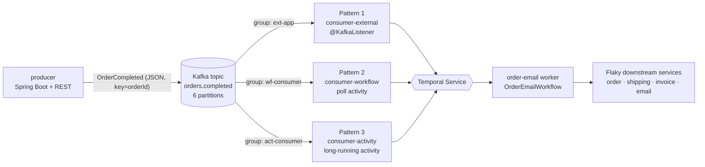
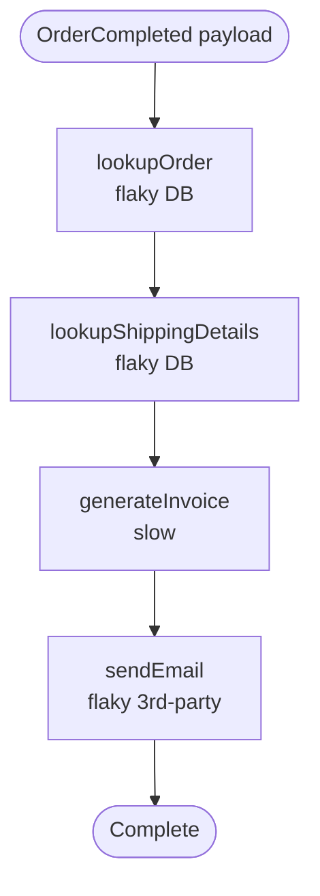
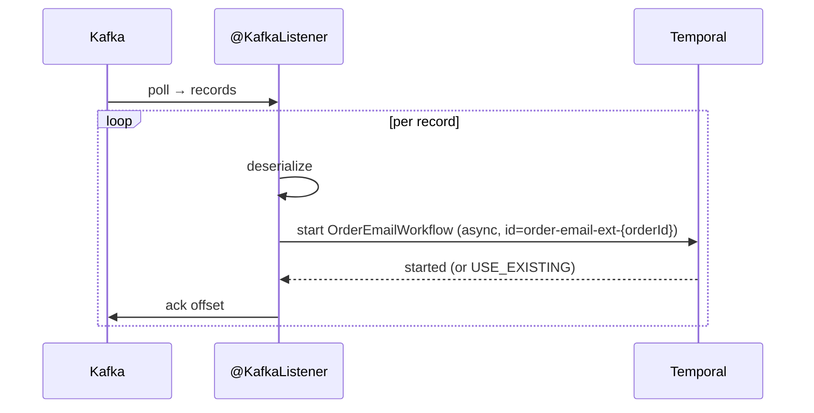
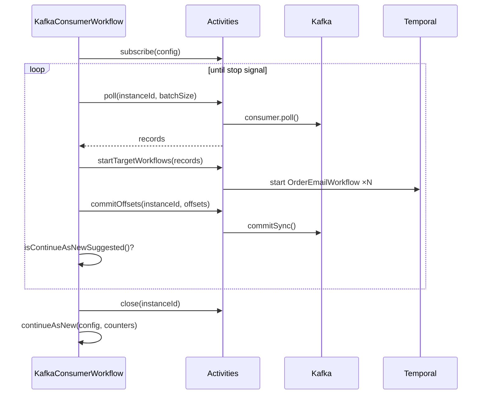
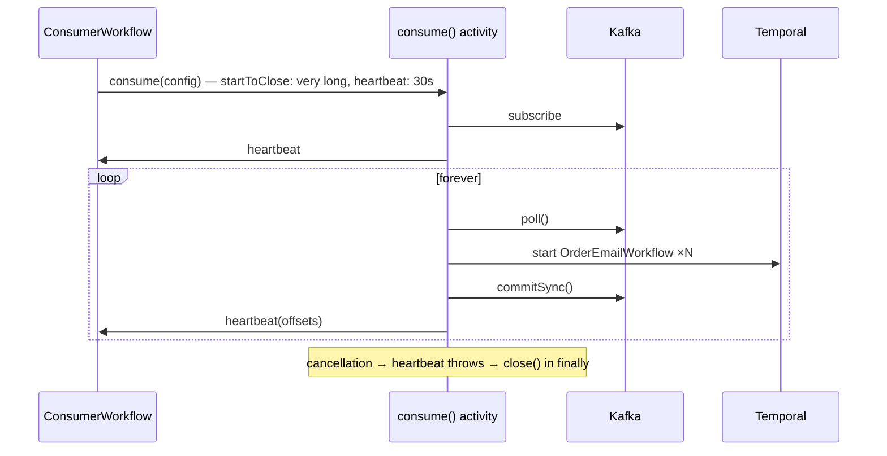

# PRD — Temporal + Kafka Consumption Reference Implementation (Java / Spring Boot)

| | |
| :- | :- |
| **Status** | Draft for review |
| **Author** | Rick Ross |
| **Last updated** | 2026-08-12 |
| **Source material** | [Consuming Kafka Messages with Temporal — Reference Architecture](https://docs.google.com/document/d/1sewpWqi2uMsHg3WDPzp15Ximh4yIr8Cnsqye65BPZTM/edit) |
| **Deliverable** | Single multi-module Maven repo containing one producer and three consumer applications |

---

## 1. Overview

The reference architecture doc describes three patterns for consuming Kafka messages and starting Temporal Workflows, and summarizes their trade-offs. It is a design document — there is no code behind it. Readers who want to adopt a pattern have to translate prose into an implementation, and the open question in the doc's comment thread ("is there a performance or scalability difference between these approaches?") is answered with "I don't know without writing code and doing performance testing."

This PRD specifies that code: a runnable, self-contained reference repository that implements **all three** patterns against a common producer and a common target workflow, so that they can be read side by side, run side by side, and measured.

**Non-goal restated as a goal:** this is not a product feature. It is a reference implementation and teaching artifact whose primary output is *clarity about the trade-offs*.

### 1.1 The three patterns

| # | Pattern | Kafka consumer lives in |
| :- | :- | :- |
| 1 | **External Application** | A plain Spring Boot app; starts a Workflow per message |
| 2 | **Workflow** | A Temporal Workflow that calls activities to poll, start, and commit |
| 3 | **Long-Running Activity** | A single Activity that loops, polls, starts Workflows, and heartbeats |

All three deliver the same outcome: for every `OrderCompleted` event on a Kafka topic, exactly one `OrderEmailWorkflow` execution runs to completion.

---

## 2. Goals and non-goals

### 2.1 Goals

- **G1** — Implement all three consumption patterns as independently runnable Spring Boot applications sharing one target workflow and one Kafka topic.
- **G2** — Provide a producer application that generates `OrderCompleted` events at a configurable rate, on demand or continuously.
- **G3** — Make the trade-offs *observable*, not just described: Actions consumed per message, visibility in the Web UI, event-history growth, and heartbeat behavior should each be directly demonstrable at runtime.
- **G4** — Demonstrate Temporal's durability benefit concretely by injecting failures into the downstream email/order/invoice services (per review feedback on the source doc).
- **G5** — **Answer the scaling question the source doc leaves open, prominently.** Demonstrate and measure that all three patterns share one ceiling — the topic's partition count — so the choice between them is an operational decision, not a throughput decision. This is the repo's headline finding (§7.4) and gets top billing in the root README, not a footnote.
- **G6** — Run locally with `docker compose up` plus a local Temporal dev server, with no cloud credentials required; switch to Temporal Cloud and a secured Kafka via a Spring profile.

### 2.2 Non-goals

- **NG1** — Not a production-hardened library or a Temporal-Kafka connector. No packaging for reuse as a dependency.
- **NG2** — No Schema Registry / Avro / Protobuf. JSON payloads only. (Called out as an extension point.)
- **NG3** — No Kafka *producer-side* Temporal integration (i.e. workflows publishing to Kafka). Consumption only.
- **NG4** — No exactly-once semantics via Kafka transactions. The repo implements at-least-once delivery plus idempotent workflow starts, and documents why that is the correct pattern here.
- **NG5** — No Publish-Subscribe fan-out inside Temporal. The source doc notes Temporal supports Competing Consumers; this stays consistent with it.
- **NG6** — Not a benchmark report. The repo ships a load-test *harness* and methodology (§12); publishing numbers is follow-on work.
- **NG7** — No dashboards. Prometheus and Grafana are out of scope; the apps expose scrape endpoints (FR-X6) and nothing consumes them in-repo.
- **NG8** — CI runs **locally only** — Testcontainers plus the Temporal test environment. No CI job authenticates to Temporal Cloud or a hosted Kafka. The `cloud` profile is documented and manually verifiable, not continuously tested.

---

## 3. Audience

| Persona | Need |
| :- | :- |
| **Customer architect** evaluating Temporal alongside an existing Kafka estate | Wants to see the three options compared honestly, with cost and visibility implications, before committing. |
| **Java/Spring developer** implementing a chosen pattern | Wants working, idiomatic code to copy — not pseudocode. |
| **Temporal SA / SE** running a discovery or demo call | Wants to start a pattern in under two minutes and show the Web UI difference between them. |

Consequence for design: **readability outranks cleverness.** Each consumer module must be understandable in isolation, and the code must map recognizably onto the bullet lists in the source doc.

---

## 4. Background and context

### 4.1 What the source doc establishes

- Kafka integration with Temporal is a common pattern; customers want to keep existing event-driven investments.
- Temporal directly supports **Competing Consumers** (workers competing for task queue tasks). Publish-Subscribe would need to be approximated via async workflow calls.
- Temporal Cloud namespaces have a default rate limit of **500 Actions/second**, adjusted based on the prior 7 days of usage. Design work must be accompanied by metrics monitoring, and higher limits use Temporal Resource Units.
- Relevant metrics: `temporal_cloud_v0_resource_exhausted_error_count` (Cloud), and `temporal_long_request_failure` / `temporal_request_failure` filtered on `status_code="RESOURCE_EXHAUSTED"` (SDK).
- The practical example — Customer ABC publishes an event when an eCommerce order completes; the order-email side of their system breaks when the email service or the customer database misbehaves. They chose the long-running activity pattern.

### 4.2 Trade-off table from the source doc (the baseline this repo must validate)

| | Long-Running Activity | Workflow | External Client |
| :- | :- | :- | :- |
| Visibility into execution | Some | Yes | None / Custom |
| Bounded by event history size | No | **Yes** | N/A |
| Requires activity heartbeating | **Yes** | No | No |
| How to scale | Multiple activities in parallel | Multiple workflows | Multiple client instances |
| Actions per message (excl. target workflow) | 1 + throttled heartbeats | **3** | 1 |

The Workflow column's **3** assumes one message per poll cycle. This repo fixes the poll batch size at 1 (FR-2.5) specifically so the implementation validates this published figure. If that constant is ever raised, this row and the source doc's cost row both become wrong and must be updated together (FR-2.5a).

### 4.3 Open questions from the doc's review that this repo should close

- **Scaling parity** (Joshua Smith): readers think in terms of a *fleet* of Kafka consumers; the thread's working conclusion was that external clients scale better because you can run many in parallel. → **§7.4 shows all three patterns share the same partition-count ceiling**, making this the repo's headline finding (G5, FR-X8) and material to fold back into the source doc's "How to Scale" row (FR-X9). Measured by §12's scale-out runs.
- **Concrete durability story**: show the email service being down and Temporal recovering. → §8.1 failure injection.

---

## 5. Requirements

### 5.1 Producer application (`producer`)

- **FR-P1** — Publishes `OrderCompleted` JSON events to a configurable topic (default `orders.completed`), keyed by `orderId` so that all events for an order land on one partition.
- **FR-P2** — Exposes a REST API:
  - `POST /orders` — publish one event; accepts an optional body to override generated fields, returns the generated `orderId`, partition, and offset.
  - `POST /orders/batch?count=N` — publish N events.
  - `POST /orders/stream?ratePerSecond=R` / `DELETE /orders/stream` — start/stop continuous generation.
  - `GET /orders/stream` — current generator state and cumulative count.
- **FR-P3** — Continuous generation is rate-limited to a configurable events/second, adjustable at runtime without restart. This is the primary knob for the load tests in §12.
- **FR-P4** — Generates plausible synthetic order data (order ID, customer ID + email, line items, totals, shipping address, timestamp) via a deterministic seedable generator so runs are reproducible.
- **FR-P4a** — **Order IDs are namespaced per producer run** (`ORD-{prefix}-{sequence}`), with the prefix derived from start time unless `app.producer.order-id-prefix` is set explicitly. Reproducibility is therefore opt-in rather than accidental. Without this, a restarted producer replays `ORD-000001` onward, every event is correctly deduplicated by FR-X2, and the run consumes messages while starting zero workflows — behaving exactly as designed while looking completely broken. It also silently converts load tests into measurements of deduplication rather than throughput. Setting the prefix and seed together remains the way to replay a run deliberately.
- **FR-P5** — Can emit a configurable percentage of **duplicate** events (same `orderId`) to demonstrate that idempotent workflow starts (FR-X2) actually work.
- **FR-P6** — Can emit a configurable percentage of **malformed** events (unparseable payload) to exercise each consumer's poison-message handling (FR-X4).
- **FR-P7** — Creates the topic on startup if absent, with configurable partition count (default 6) — the partition count is the scaling ceiling discussed in §7 and must be easy to change.

### 5.2 Pattern 1 — External Application (`consumer-external`)

- **FR-1.1** — Uses **spring-kafka** `@KafkaListener` with `AckMode.MANUAL_IMMEDIATE`; the handler receives an `Acknowledgment`.
- **FR-1.2** — For each record: deserialize → start `OrderEmailWorkflow` asynchronously (`WorkflowClient.start`, not `execute` — the consumer must not block on workflow completion) → acknowledge.
- **FR-1.3** — Acknowledges **only after** the workflow start is durably accepted by the Temporal service. A start failure must not advance the offset.
- **FR-1.4** — Listener concurrency configurable (`app.kafka.concurrency`), and the app must be runnable as multiple instances in one consumer group. README documents both scale-out axes.
- **FR-1.5** — Exposes no Temporal worker by default; the worker that *executes* `OrderEmailWorkflow` is a separate concern (§6.3). The README must be explicit that this app is a *client*, not a worker.

### 5.3 Pattern 2 — Workflow (`consumer-workflow`)

- **FR-2.1** — A `KafkaConsumerWorkflow` implements the loop from the source doc using activities: `subscribe`, `poll`, `startTargetWorkflow`, `commitOffsets`, `close`.
- **FR-2.2** — Uses `Workflow.getInfo().isContinueAsNewSuggested()` as the primary continue-as-new trigger, with a configurable hard cap on loop iterations as a secondary guard. Continue-as-new carries forward the consumer config and cumulative counters.
- **FR-2.3** — Exposes `@SignalMethod stop()` for graceful shutdown and `@QueryMethod status()` returning messages processed, current partition assignment, last committed offsets, iteration count, and current history length.
- **FR-2.4** — Every consumed message is visible in the workflow's event history — this is the pattern's entire value proposition and must be obvious in the Web UI.
- **FR-2.5** — Documents and instruments its Action cost: **3 Actions per message**, matching the source doc. The poll batch size is **fixed at 1 by default**, expressed as a single named constant (`KafkaConsumerWorkflowConfig.DEFAULT_BATCH_SIZE = 1`) rather than scattered literals, so it can be raised in one edit later. Batching to N records per activity result would amortize the loop cost toward 3 Actions per *batch*; the code and README must note that possibility without adopting it.
- **FR-2.5a** — The constant carries a comment stating that **changing it invalidates the 3-Actions/message cost row in the [source reference architecture doc](https://docs.google.com/document/d/1sewpWqi2uMsHg3WDPzp15Ximh4yIr8Cnsqye65BPZTM/edit), which must be updated to match.** The same note goes in the module README and in §4.2's table footnote here. The PRD, the code, and the published doc must not be allowed to drift apart silently.
- **FR-2.6** — Runs on a **task queue scoped to the consumer instance**, with the workflow and its activities co-located on that queue and a single worker serving it, so the worker-local consumer handle is always reachable from every activity (§7.2.2). Must survive worker restart by rebuilding the consumer and resuming from committed offsets.

### 5.4 Pattern 3 — Long-Running Activity (`consumer-activity`)

- **FR-3.1** — A trivial `KafkaConsumerActivityWorkflow` sets activity options and invokes one long-running `consume` activity, passing broker/topic/group config.
- **FR-3.2** — Activity options: a very long `startToCloseTimeout`, a `heartbeatTimeout` on the order of tens of seconds, and unlimited retries with backoff. The rationale for each value goes in a code comment — these are the settings readers most often get wrong.
- **FR-3.3** — The activity heartbeats on every loop iteration *and* during idle polls, carrying last-committed offsets as heartbeat details. Heartbeats are throttled by the SDK to a fraction of the heartbeat timeout, so per-iteration calls are safe — the README must state this so readers don't hand-roll their own throttling.
- **FR-3.4** — On cancellation (heartbeat throws), the activity closes the consumer in a `finally` block and completes. Killing the app must not leave the consumer group rebalancing indefinitely.
- **FR-3.5** — Supports **N parallel consumer activities** from a single workflow (async activity invocations), configurable, to demonstrate the "run multiple activities in parallel" scaling answer from the trade-off table.
- **FR-3.6** — Worker configuration must set `maxConcurrentActivityExecutionSize` and the activity poller count above the number of long-running activities. A long-running activity never releases its slot; the default worker config will silently starve. This gotcha must be commented in code and called out in the README.

### 5.5 Cross-cutting requirements

- **FR-X1** — **Shared target workflow.** All three patterns start the same `OrderEmailWorkflow` (§6.3), on the same task queue, executed by the same worker. Any behavioral difference between patterns is therefore attributable to the consumption approach alone.
- **FR-X2** — **Idempotent starts.** Workflow ID is deterministic: `order-email-{pattern}-{orderId}`. Starts use `WorkflowIdReusePolicy.ALLOW_DUPLICATE_FAILED_ONLY` with the default conflict policy, and callers catch `WorkflowExecutionAlreadyStarted` and treat it as success. The `{pattern}` segment lets all three consumers run concurrently against the same events without colliding. Implemented once in `OrderEmailStarter` (in `common`) and used by all three patterns plus the worker's demo endpoint, so start semantics cannot drift between them.

  > **Revised during M2.** This originally specified `WorkflowIdConflictPolicy.USE_EXISTING` on the grounds that a no-op beats an exception to catch. Two problems surfaced in implementation. First, USE_EXISTING governs only a *running* execution — the common redelivery case is a replay after the workflow has already **completed**, which it does not cover; the reuse policy does. Second, USE_EXISTING attaches silently and reports nothing, so deduplications become unmeasurable and FR-P5's duplicate-injection demo can prove nothing. `ALLOW_DUPLICATE_FAILED_ONLY` rejects a replay after a successful run while still allowing recovery after a failed or terminated one, and every rejection is counted. Catching `WorkflowExecutionAlreadyStarted` is the idiomatic Temporal dedup pattern and is a single `catch` block in shared code.
- **FR-X3** — **Separate consumer groups** per pattern, so all three can run simultaneously and each sees every event. This is what makes side-by-side comparison possible.
- **FR-X4** — **Poison-message handling.** A record that cannot be deserialized must not block its partition. Pattern 1 uses spring-kafka's `DefaultErrorHandler` + `DeadLetterPublishingRecoverer`; patterns 2 and 3 implement the equivalent (publish to `orders.completed.DLT`, log, commit past it). Behavior must be consistent across all three.
- **FR-X5** — **Consistent configuration surface.** Bootstrap servers, topic, group ID, poll timeout, batch size, and Temporal target/namespace/task queue use the same property names across modules.
- **FR-X6** — **Metrics.** Every app exposes Micrometer/Prometheus at `/actuator/prometheus`, including Temporal SDK metrics and app-level counters (messages consumed, workflows started, duplicates skipped, DLT'd records, end-to-end latency from event timestamp to workflow start).
- **FR-X7** — **README per module**, plus a root README with a decision guide (§10) and a "run this in 2 minutes" quickstart.

### 5.6 Non-functional requirements

- **NFR-1** — Java 21, Spring Boot 3.x, `io.temporal:temporal-spring-boot-starter` (stable, 1.31.0 at time of writing — pin the latest at implementation time). Versions managed in the parent POM's `dependencyManagement`.
- **NFR-2** — Quickstart is: `docker compose up -d`, `temporal server start-dev`, then `mvn spring-boot:run` in two modules. No credentials, no cloud account, no manual topic creation.
- **NFR-3** — No message loss under `SIGTERM`, worker restart, or Temporal service unavailability, for any pattern. At-least-once with duplicates is acceptable and expected; silent loss is not.
- **NFR-4** — Each pattern must sustain the load-test target rate (§12) without falling behind, or the README must document the observed ceiling and its cause.
- **NFR-5** — Unit tests for the target workflow using Temporal's test framework; integration tests for each consumer using Testcontainers (Kafka) plus the Temporal test environment. Runnable in CI without Docker Compose.

---

## 6. Architecture

### 6.1 System view



### 6.2 Module layout

```
kafka-consumption/                    parent POM, docker-compose.yml, root README
├── common/                           shared, no main class
│   ├── model/                        OrderCompleted, OrderEmailRequest, DLT envelope
│   ├── workflow/                     OrderEmailWorkflow + impl, activity interfaces + impls
│   ├── downstream/                   flaky order/shipping/invoice/email services
│   ├── kafka/                        shared Kafka consumer/producer factory + props
│   └── temporal/                     workflow-ID conventions, shared start helper, metrics names
├── producer/                         FR-P1..P7
├── consumer-external/                Pattern 1
├── consumer-workflow/                Pattern 2
├── consumer-activity/                Pattern 3
└── order-email-worker/               hosts OrderEmailWorkflow + its activities
```

`order-email-worker` is a fifth module, split out deliberately: it keeps FR-X1 honest (one worker for all three patterns) and it makes the point that *consuming* and *executing* are separate scaling concerns.

### 6.3 The shared target workflow

`OrderEmailWorkflow` implements Customer ABC's scenario from the source doc:



Each activity has explicit retry policies and timeouts. Failure injection is configurable per activity (§8.1) so a demo can take the email service down mid-run and show workflows parked in retry, then completing when it returns — the durability story the source doc's reviewer asked for.

---

## 7. Detailed design per pattern

### 7.1 Pattern 1 — External Application



**Design notes**
- `WorkflowClient` is injected by the Temporal Spring Boot starter. No worker is registered in this app.
- Ack-after-start ordering is the whole correctness story: a Temporal outage means the offset does not advance and spring-kafka's error handler retries. Duplicates on redelivery are absorbed by FR-X2.
- **Scaling:** `concurrency` raises consumer threads within one instance; running M instances in the group spreads partitions across pods. Combined ceiling is the partition count (6 by default).
- **Visibility:** none by default — the gap between "message read" and "workflow started" is invisible to Temporal. The module demonstrates the "custom" answer from the trade-off table via structured logs plus the FR-X6 latency metric, and the README is explicit that this is *your* problem to solve in this pattern.
- **Cost:** 1 Action per message (the workflow start).

### 7.2 Pattern 2 — Workflow



#### 7.2.1 Continue-as-new

Driven by `isContinueAsNewSuggested()` rather than a hand-tuned event count — the service's own signal is the correct trigger and it keeps the sample robust as limits change. A configurable `maxIterations` guard exists so a demo can force a continue-as-new on command. The advisory history threshold is ~10K events / 10 MB and the hard limit is 51,200 events / 50 MB; verify against current docs at implementation time and cite in the README, don't hardcode the numbers into logic.

#### 7.2.2 Consumer handle: task-queue-per-instance with workflow/activity co-location

A `KafkaConsumer` is not serializable and cannot be workflow state. It lives in a worker-local registry keyed by an `instanceId`. The resolution is structural rather than defensive:

**Each consumer instance gets its own task queue — `kafka-consumer-{instanceId}` — and the `KafkaConsumerWorkflow` and all of its activities are pinned to that same task queue, served by exactly one worker process.** The consumer handle and every activity that touches it are therefore always in the same JVM. There is no routing race and no cross-worker cache miss.

Implementation rules this implies:

- **FR-2.7** — The worker for a consumer instance registers the workflow *and* its activities on the one instance-scoped task queue, and nothing else. `order-email-worker` remains on its own separate task queue (FR-X1).
- **FR-2.8** — Activity options set the task queue **explicitly** to the workflow's own queue. In the Java SDK activities inherit the workflow's task queue by default, so this is belt-and-braces — but it must be explicit in the sample, because the failure mode if someone later overrides it is subtle and data-losing rather than loud.
- **FR-2.9** — **Exactly one worker per consumer task queue.** A second worker polling the same queue reintroduces the split-brain this design eliminates: activities could land on the JVM without the consumer. Scale out by adding *instances* (new instanceId → new task queue → new worker → new workflow execution), never by adding workers to an existing queue. The README and the deployment manifest must both state this — it inverts the usual Temporal instinct that more workers on a queue is always safe.
- **FR-2.10** — Continue-as-new inherits the task queue, so the instance stays pinned across continuations. The `instanceId` is carried forward in the continue-as-new arguments.

**Worker restart is the one remaining recreate path.** If the worker process dies, the cached consumer dies with it; the restarted worker rebuilds it on the next `poll` and resumes from Kafka's committed offsets. Because `commitOffsets` runs as a separate activity *after* the workflow starts succeed, the worst case is redelivery of an uncommitted batch — absorbed by FR-X2. This is ordinary crash recovery, not a design hole, and the integration test in NFR-5 must cover it by killing the worker mid-run.

The honest cost of this pattern is now an **operational constraint rather than a correctness risk**: a one-to-one binding between consumer instance, task queue, worker process, and workflow execution. That is more deployment ceremony than patterns 1 and 3 need, and the decision guide should price it in.

- **Scaling:** run multiple `KafkaConsumerWorkflow` executions, each on its own instance-scoped task queue with its own worker, up to the partition count.
- **Visibility:** maximum — every poll, start, and commit is an event in history.
- **Cost:** 3 Actions per poll cycle. At the default `batchSize=1` this is **3 Actions/message, matching the source doc** — the repo validates the published figure rather than contradicting it. Raising the constant amortizes the loop cost across the batch (at 50, roughly 0.06 Actions/message for the loop); if that change is ever made, the source doc's cost row must be updated with it (FR-2.5a). Target workflow starts are counted separately and are unaffected either way.

### 7.3 Pattern 3 — Long-Running Activity



**Design notes**
- Heartbeat details carry last-committed offsets. Kafka's own committed offsets already provide resumption, so the details are primarily for *observability* — visible in the Web UI as pending-activity info, which is the "Some" visibility in the trade-off table. The README should be honest about this: the details are not load-bearing for correctness.
- Retry policy with unlimited attempts means a broker outage that kills the loop results in a new attempt with backoff rather than a failed workflow.
- **FR-3.6 is the trap:** with the default worker config, a handful of never-returning activities exhausts the execution slots and all other activity work stalls. Set `maxConcurrentActivityExecutionSize` and poller counts above the consumer count, and prefer a dedicated worker/task queue for consumer activities.
- **Scaling:** `Async.function` to launch N consume activities in one workflow, or N workflows — both demonstrated, both capped by partition count.
- **Cost:** 1 Action per message plus 1 per throttled heartbeat, matching the doc.

### 7.4 Scaling — the headline finding

> **All three patterns hit the same ceiling: the number of partitions on the topic.**
>
> Kafka assigns each partition to at most one consumer in a group. A fleet of external clients, a fleet of consumer workflows, and a fleet of long-running activities are therefore bounded **identically**. Adding a 7th consumer of any kind to a 6-partition topic yields an idle consumer, not more throughput. Partition count — not the choice of pattern — is the throughput lever.

This is the most important thing the repository has to say, and it is treated as a **first-class deliverable, not a footnote** (see FR-X8). It directly addresses the source doc's review thread, where the working conclusion was that external client applications scale better than in-Temporal approaches. That intuition is about *familiarity of tooling*, not about throughput.

What actually differs between the patterns is operational:

| | Unit of scale | How you add capacity | Ops surface |
| :- | :- | :- | :- |
| Pattern 1 | Pod / listener thread | Scale the deployment | Your existing tooling; lowest friction |
| Pattern 2 | Instance = task queue + worker + workflow | Provision a new instance | Temporal-native, but the 1:1:1 binding is real ceremony |
| Pattern 3 | Activity execution | Start another consume activity or workflow | Temporal-native; needs worker slot headroom (FR-3.6) |

**Where a real difference does emerge:** not in consumption throughput, but downstream of it. Every pattern starts the same `OrderEmailWorkflow`, and *that* work scales independently on its own task queue and worker pool, unbounded by partition count. The practical implication is that consumption is rarely the bottleneck worth optimizing — a point the decision guide should make, because it reframes the whole comparison.

- **FR-X8** — The partition-count ceiling is stated in the root README **above the pattern comparison**, demonstrated by a runnable scenario (scale one pattern past the partition count, show the idle consumer and flat throughput), and measured by the §12 scale-out runs at 1/3/6 units against 6 partitions. All three patterns must show the same knee in the curve.
- **FR-X9** — The finding is written up in a form that can be **folded back into the source reference architecture doc**, whose "How to Scale" row currently implies the patterns differ in scalability. Delivered as a short section in the root README that can be lifted verbatim.

---

## 8. Cross-cutting behavior

### 8.1 Failure injection (G4)

The downstream services in `common/downstream` are configurable via properties:

- `app.chaos.email.failureRate` / `app.chaos.email.down` (hard outage toggle)
- `app.chaos.orderDb.failureRate` / `.latencyMs`
- `app.chaos.invoice.latencyMs`

Toggleable at runtime via an actuator-style endpoint on `order-email-worker`, so a demo can take email down, show workflows accumulating in retry with their history visible, bring it back, and show them all complete without intervention. This is the concrete answer to "it would be good to speak briefly to how Temporal improves their system's reliability."

### 8.2 Delivery semantics

At-least-once + idempotent workflow starts, uniformly across all patterns. Every consumer commits offsets *after* successful workflow starts. The README documents the resulting guarantee, why Kafka transactions are not used (NG4), and the duplicate-injection knob (FR-P5) that proves the dedup works.

### 8.3 Environments and profiles

| Profile | Kafka | Temporal |
| :- | :- | :- |
| `local` (default) | Docker Compose, PLAINTEXT `localhost:9092` | `temporal server start-dev`, namespace `default` |
| `cloud` | Configurable `SASL_SSL` + SCRAM/API-key properties | Temporal Cloud address + namespace, API key **or** mTLS key/cert paths |

Kafka runs from the official `apache/kafka` image in KRaft mode (no ZooKeeper), plus a Kafka UI container for topic/offset inspection during demos. The `cloud` profile ships as a documented, credential-free `application-cloud.yml` template using environment-variable placeholders. Both auth mechanisms are shown for Temporal Cloud since customers use both.

---

## 9. Observability

- **App metrics:** `kafka.messages.consumed`, `temporal.workflows.started`, `temporal.workflows.duplicate_skipped`, `kafka.records.dlt`, and a timer for event-timestamp → workflow-start latency, all tagged by `pattern`.
- **SDK metrics** exported through Micrometer, including the two RESOURCE_EXHAUSTED queries from the source doc:
  - `rate(temporal_long_request_failure_total{status_code="RESOURCE_EXHAUSTED"}[$__rate_interval])`
  - `rate(temporal_request_failure_total{status_code="RESOURCE_EXHAUSTED"}[$__rate_interval])`
- **Cloud metrics** referenced in the README for Cloud users: `temporal_cloud_v0_resource_exhausted_error_count`.
- **No Grafana or Prometheus in this repo** (NG7). The scraped `/actuator/prometheus` endpoints are the deliverable; visualization is left to whatever the reader already runs. This keeps Compose to Kafka plus Kafka UI and keeps the quickstart at NFR-2's two-minute target. The load test in §12 collects its numbers by scraping the endpoints directly.

---

## 10. Decision guide (root README content)

**Start here, before comparing patterns:** all three are bounded by the same thing — your topic's partition count (§7.4). None of them is faster than the others at consuming. If throughput is the problem, add partitions; the pattern you pick will not change the ceiling. Choose instead on **visibility, Action cost, and what you want to operate.**

Choose **Pattern 1 (External Application)** when the read-to-start gap needs no Temporal-native visibility, you already have deployment tooling for stateless consumers, and you want the lowest Action cost and the least novel machinery. *This is the default recommendation for most customers.*

Choose **Pattern 2 (Workflow)** when per-message visibility in workflow history is a genuine requirement — audit, compliance, or debugging an unreliable upstream. Accept continue-as-new management, the highest Action cost, and the deployment ceremony of §7.2.2: each consumer instance is a task queue, a worker, and a workflow execution bound one-to-one.

Choose **Pattern 3 (Long-Running Activity)** when you want the consumer's lifecycle managed by Temporal — visible, restartable, no separate deployment — without per-message history. Accept heartbeat configuration and worker slot headroom as the price. *This is what Customer ABC chose, and it is the best fit when the goal is "one less thing to operate."*

The guide should also carry the source doc's framing: consider whether the broader process Kafka is coordinating is itself a candidate for Temporal orchestration. Sometimes the answer removes the integration question entirely.

And it should close by pointing past consumption: the target workflows started by any of these patterns scale on their own task queue and worker pool, unbounded by partitions. That is where throughput work usually belongs.

---

## 11. Repository deliverables checklist

- [ ] Parent POM with dependency management; five modules build with `mvn clean verify`
- [ ] `docker-compose.yml`: Kafka (KRaft) + Kafka UI only
- [ ] `common` module: model, target workflow + activities, flaky downstream services, shared Kafka/Temporal helpers
- [ ] `order-email-worker`: hosts the target workflow, chaos toggles endpoint
- [ ] `producer`: FR-P1 – FR-P7
- [ ] `consumer-external`: FR-1.1 – FR-1.5
- [ ] `consumer-workflow`: FR-2.1 – FR-2.10 (incl. task-queue-per-instance provisioning script)
- [ ] `consumer-activity`: FR-3.1 – FR-3.6
- [ ] Root README: quickstart, **partition-ceiling finding above the pattern comparison (FR-X8)**, architecture diagrams, decision guide, cost table
- [x] `scripts/demo-partition-ceiling.sh`: runnable proof of §7.4 — scales a pattern across configurable consumer counts on a 6-partition topic, printing member assignment, idle count, drain time, and throughput relative to baseline. Measured 1/3/6/9: knee at 6, **3 idle at 9**, throughput 2.93x → 2.78x (slightly down). Also surfaced that scaling below the ceiling is sub-linear, reinforcing that consumption is rarely the binding constraint.
- [x] Write-up of the ceiling finding in liftable form for the source doc's "How to Scale" row (FR-X9) — delivered as `docs/google-doc-edit-pack.md`, covering the ceiling finding plus nine further revisions, all approved 2026-08-14
- [ ] Per-module README with run instructions and the specific gotchas of that pattern
- [ ] `application-cloud.yml` templates (Temporal Cloud API key + mTLS; Kafka SASL_SSL)
- [ ] Tests: workflow unit tests + Testcontainers integration tests per consumer
- [x] `scripts/load-test.sh`: matrix across patterns × rates × scale, recording throughput, kept-up, p50/p95/p99 latency, modeled Actions/s, RESOURCE_EXHAUSTED, worker CPU/heap, and Pattern 2 history growth. CSV output. Shared helpers in `scripts/lib/common.sh`.

---

## 12. Performance and load test plan

Purpose: replace "I don't know without writing code and doing performance testing" with data.

**Method.** Fix the topic at 6 partitions and the target workflow's chaos rates at zero. **First establish the producer's own ceiling on the hardware under test**, then choose rungs below it: any rate the producer cannot sustain measures the producer instead of the consumer, and reports it as a consumer result (Finding 5). On the laptop these numbers came from that ceiling is near 157 events/s, so the ladder is 10, 50, 100, 150 events/s. For each pattern, drive the producer at those rates and record:

- Delivered rate against requested rate, so a producer-bound case is visible at the point of measurement rather than derived from lag arithmetic afterwards
- Sustained throughput before consumer lag grows monotonically
- p50 / p95 / p99 event-timestamp → workflow-start latency
- Actions/second consumed, measured against the 500 Actions/s default namespace limit
- `RESOURCE_EXHAUSTED` rate
- Worker CPU/memory, and for Pattern 2, event-history growth and continue-as-new frequency

**Scale-out runs — the headline experiment.** For each pattern, repeat at 1, 3, 6, and **9** units of scale (pods / workflow instances / parallel activities) against the 6-partition topic. The 9-unit run is the point: it must show three idle consumers and no throughput gain, in every pattern, confirming §7.4's ceiling. Record throughput and per-unit partition assignment at each step.

**Scope note vs NG6.** The ceiling demonstration is *not* deferred — it ships as a runnable script (`scripts/demo-partition-ceiling.sh`) that stands up one pattern at 6 and then 9 units and prints the assignment plus throughput, and it is covered by acceptance criterion 12. What remains follow-on is the full benchmark matrix across all patterns and rates, and publishing those numbers.

**Tuning knobs to document** (from the source doc's Decisions section): namespace Actions/s and per-task-queue activity rate limits; worker `MaxConcurrentWorkflowTaskPollers`, `MaxConcurrentActivityTaskPollers`, `MaxConcurrentWorkflowTaskExecutionSize`, `MaxConcurrentActivityTaskExecutionSize`, `MaxCachedWorkflows` / sticky cache size, `MaxWorkflowThreadCount`, and replica count.

The load test is a deliverable of the repo (scripts + methodology). Executing it and publishing results is explicitly follow-on work, so that the implementation milestone isn't gated on benchmark cycles.

### 12.1 Findings from the load-test runs (2026-08-13, 2026-08-18, 2026-08-19)

Single instance, 6-partition topic, 40 to 45s per case, all components on one laptop with a Temporal dev server. `RESOURCE_EXHAUSTED` was zero throughout, so none of this is namespace rate limiting.

| Pattern | 10/s | 50/s | 100/s | p50 @ 50/s |
| :- | :- | :- | :- | :- |
| 1 — External App | 10.3 ✓ | 51.6 ✓ | 93–103 ~ | 0.011 s |
| 2 — Workflow (batch 1) | **3.4 ✗** | **3.4 ✗** | **3.4 ✗** | **24.7 s** |
| 3 — Long-Running Activity | 10.3 ✓ | 51.5 ✓ | 99–107 ~ | 0.011 s |

✓ kept up. ✗ fell behind, so the figure is a ceiling rather than a rate. ~ at the saturation edge, keeping up in most runs but not all. The 100/s column is a range over six runs; the 150/s column an earlier draft published is retired, because it sat just under the producer's own ceiling and disagreed with itself by 1.95× (Findings 2 and 5).

**Finding 1 — batch size is a throughput decision, not just a cost decision.** Pattern 2 at one record per poll sits near 3.4 msg/s *at every rate from 10/s to 100/s offered*, and cannot keep up with even 10 events/s. Each message costs three serialized activity round-trips (poll → start → commit), a hard floor unrelated to Kafka or the target workflow. At `batch-size=50` the same pattern reaches 51.7 msg/s with 0.57s p50 — **15× throughput, 45× latency**.

Because instances are capped by partition count, batch-size 1 tops out around 6 × 3.4 ≈ 20 msg/s for the *entire pattern* on a 6-partition topic. It cannot be scaled into viability.

"Pinned regardless of offered rate" turns out to be the optimistic reading. Under a deep backlog the loop gets *slower*: at roughly 170/s offered it managed **1.5 and 1.6 msg/s** across two cases, with history length falling to about 1,530 from 3,519, so fewer poll cycles completed rather than each one costing more. No mechanism is established for this and none should be asserted. It is recorded as an open question, and it strengthens rather than weakens the finding.

**This is the single most consequential thing the repo measured, and it is not visible in the source doc's cost table at all** — that table compares Actions per message and is silent on throughput. On Actions alone, batch-size 1 looks merely expensive; in practice it is unusable above trivial volumes. Recommend adding a throughput row to the reference architecture's trade-off table, and stating that batch-size 1 exists to reproduce the published cost figure rather than as a production configuration.

**Finding 2 — saturation figures on this hardware are too noisy to rank patterns 1 and 3.** At 150/s offered, Pattern 3 measured 138.2 msg/s in one run and 70.9 in a repeat of the *identical* configuration, a **1.95×** spread on a single afternoon. Pattern 1 spread 1.15× across the same pair. Below saturation the picture is entirely different: six runs at 100/s spanned **1.11×** for Pattern 1 and **1.07×** for Pattern 3, with the two patterns statistically indistinguishable at roughly 102 msg/s each. Any ranking of patterns 1 and 3 built on single saturation runs is therefore unsupported, and an earlier draft of this section wrongly attributed a 70-vs-138 gap to commit granularity.

Two consequences. First, the batch-size finding above stands comfortably because 15× is far outside this noise band, whereas differences under ~2× on a saturated laptop are not interpretable. Second, any future ranking of patterns 1 and 3 needs repeated runs with a variance figure, on hardware that is not also running the broker, the worker, and the Temporal service.

There is a plausible mechanism worth *testing* rather than asserting: Pattern 1 uses `AckMode.MANUAL_IMMEDIATE` and commits per record, while Pattern 3 commits once per poll batch, so per-record commit costs a synchronous broker round-trip per message. That is a hypothesis, not a result. It should not change Pattern 1's implementation regardless — ack-per-record ordering is what makes its correctness story simple to explain.

The six repeated runs at 100/s are weak evidence against it mattering below saturation. If per-record commit carried a meaningful cost, Pattern 1 should be measurably slower than Pattern 3 wherever both are cleanly fed and repeatable. It is not: the two land within a percent of each other. Whatever the commit granularity costs, it is smaller than the run-to-run noise at the only rate where that noise is small enough to see through.

**Finding 3 — scale-out is sub-linear and mostly buys latency.** At 150/s offered, tripling consumers took Pattern 1 from 60.7 to 129.5 msg/s (2.13×) and Pattern 3 from 70.9 to 148.9 (2.10×). The throughput gain is real but well short of 3×; the latency gain is the larger effect — Pattern 3's p50 fell from 14.5s to 0.84s, Pattern 1's from 22.3s to 5.0s. Combined with §7.4's partition ceiling, the practical guidance is: scale out to reduce latency and to reach the partition count, not in the expectation of linear throughput.

Treat those two multiples as **lower bounds rather than measurements**. Pattern 3's 3-consumer figure of 148.9 msg/s is within 5% of the producer's own ~157/s ceiling, so that run was probably starved and its real capacity is higher. The single-consumer baselines have the opposite problem, being one draw from a distribution that spans 1.95× at this rate. The sub-linearity conclusion survives both, since neither error is anywhere near large enough to turn 2.1× into 3×, and the latency result is unaffected because latency was never near a producer limit.

**Finding 3a — the source doc's cost row is not comparable across columns.** Working through one poll cycle at batch size N, the Workflow pattern schedules three activities and starts N workflows: 3 + N Actions for N messages, or 1 + 3/N per message. The published figure of 3 per message counts the three activity schedules but omits the workflow start — which is exactly what the External Client column's "1 action per message" *is*. Corrected, the Workflow pattern costs **4 Actions per message unbatched and 1.06 batched at 50**, against 1 for the other two. "Most Expensive" is therefore true only in the configuration nobody should run. The load-test harness had inherited the same inconsistency (modeling Pattern 2 as 3/batch rather than 1 + 3/batch) and has been corrected.

**Finding 4 — what the ceiling is not.** Across 15 cases `RESOURCE_EXHAUSTED` was zero, worker CPU never exceeded 5%, and worker heap stayed under 190 MB. Neither the namespace Actions limit nor worker capacity was the binding constraint. Above roughly 150/s the question cannot be asked at all on this hardware, because the producer saturates near 157 events/s and every higher rung measures it instead (Finding 5).

So the constraint that stalls patterns 1 and 3 between 50 and 100 events/s is **not yet identified**. Candidates worth isolating are round-trip latency through the local Temporal service, single-JVM consumer limits, and broker contention from running every component on one machine. An earlier draft of this finding asserted the worker was the ceiling while citing sub-4% worker CPU as the evidence, which does not follow, and then substituted a round-trip-latency claim that the run did not test.

None of this weakens §7.4. Whatever binds first, it is measurably not consumption itself, which is the point that guidance rests on.

**Finding 5 — the harness could not distinguish offered load from delivered load.** The producer on this hardware saturates near **157 events/s**, measured directly by bracketing the window with the topic's `LOG-END-OFFSET`. The original ladder ran to 500, so a third of its cases were measuring the producer while reporting the result as a consumer figure. The 250 and 500 rungs offered the same load under different labels, which is why they produced similar and occasionally inverted results, and why a "kept up" verdict appeared at 500/s where lag was small only because little had arrived.

`kept_up` compounded it by comparing final lag against the *requested* rate, so the threshold moved with each row: at 500/s requested any lag under 500 records passed, while the same lag at 50/s failed. The column was therefore not comparable between rows.

Both are fixed. `scripts/load-test.sh` reports delivered rate against requested rate for every case and warns when they diverge, `kept_up` compares against measured throughput, and the default ladder stops at 150. Recomputing the corrected verdict over all 41 saved result rows changes none of them, so no published figure depended on the bug.

The transferable lesson is in §12's method: **establish the producer's ceiling before choosing rungs**. A benchmark that cannot tell "the consumer could not keep up" from "the producer never sent it" will confidently report the second as the first.

---

## 13. Milestones

| # | Milestone | Contents |
| :- | :- | :- |
| M0 | ✅ This PRD approved | — |
| M1 | ✅ Foundation | Parent POM, Compose, `common`, `order-email-worker`, `producer`. Demoable: publish an event, start a workflow by hand, watch chaos-driven retries. Verified end to end — see README. |
| M2 | ✅ Pattern 1 | `consumer-external`, end-to-end, README. Testcontainers + embedded Temporal integration tests cover start, dedup, and DLT routing. Surfaced and fixed the FR-P4a order-ID collision. |
| M3 | ✅ Patterns 2 & 3 | `consumer-workflow` and `consumer-activity`, including the §7.2.2 task-queue-per-instance design and FR-3.6 worker config. Verified live: all three patterns against one topic produced identical totals (278 consumed / 218 started / 60 deduplicated / 13 dead-lettered), Pattern 2 continued-as-new mid-run without losing or double-counting a message, and its stop signal closed the consumer group cleanly. |
| M4 | Comparison layer | Root README decision guide, **partition-ceiling finding + `demo-partition-ceiling.sh` (FR-X8/X9)**, cost table validation, metrics, tests. |
| M5 | ✅ Load test | `scripts/load-test.sh` + `scripts/demo-partition-ceiling.sh`, both executed. Surfaced the batch-size-1 throughput finding below, which materially changes the Pattern 2 recommendation. |

---

## 14. Risks and open items

| Risk | Impact | Mitigation |
| :- | :- | :- |
| Someone scales Pattern 2 by adding a second worker to a consumer task queue | Activities land on a JVM with no consumer handle — silent split-brain, stalled or duplicated consumption | FR-2.9: one worker per consumer task queue, stated in README, deployment manifest, and a code comment; integration test asserts the single-worker binding |
| Pattern 2's 1:1:1 instance binding is deployment ceremony | Readers judge the pattern unwieldy | Make it explicit and priced-in rather than hidden (§7.2.2, decision guide); ship a script that provisions an instance end to end |
| Long-running activity starves worker slots | Pattern 3 appears broken under load | FR-3.6: explicit worker config + code comments + dedicated task queue |
| **Pattern 3 consumers orphaned by killing the process** — the workflow survives and the next worker resurrects its activities, so consumers silently accumulate across restarts until they exhaust the worker's slots | Consumers that never start, and throughput measurements polluted by ghosts of earlier runs. Hit for real while building the ceiling demo. | Documented prominently in `consumer-activity/README.md` and the root Troubleshooting section; the correct stop is `temporal workflow terminate`, not `kill`. The demo script terminates the workflow before killing the process and sweeps orphans on startup. |
| Pattern 2's batch size gets raised later and the source doc's 3-Actions/message row silently goes stale | Published reference architecture misstates cost; readers size namespaces wrong | FR-2.5a: batch size is one named constant carrying a comment that changing it requires updating the Google Doc; same note in §4.2 and the module README |
| `cloud` profile rots because CI never exercises it (NG8) | Cloud instructions break without anyone noticing | Keep the profile thin (connection config only, no code paths); manual verification checkpoint before any release/demo use |
| Five modules is a lot of surface for a reference repo | Readability suffers (§3) | Hard constraint: each consumer module readable in isolation; shared code limited to model, target workflow, and thin helpers |
| Temporal Spring Boot starter behavior across 3.x/4.x | Build churn | Pin Spring Boot 3.x and starter 1.31.0+ in the parent POM; single place to bump |

**Resolved:**

- Pattern 2 poll batch size — **fixed at 1**, as a single named constant, with a doc-sync comment (FR-2.5, FR-2.5a).
- Grafana/Prometheus — **out of scope** (NG7); scrape endpoints only.
- CI — **local only** (NG8); no Cloud credentials in any pipeline.

- Partition-count ceiling (§7.4) — **promoted to the repo's headline finding.** Top billing in the root README above the pattern comparison, opens the decision guide, demonstrated by a runnable scenario, measured by the §12 scale-out runs, and written up for folding back into the source doc (G5, FR-X8, FR-X9).

**Still open for you:** nothing blocking. Approve and M1 starts.

---

## 15. Acceptance criteria

1. `docker compose up -d` + `temporal server start-dev` + two `mvn spring-boot:run` commands produce a completed `OrderEmailWorkflow` in the Web UI, from a clean clone, with no credentials.
2. All three consumers run **simultaneously** against the same topic; one produced event yields three workflow executions with distinguishable IDs.
3. Duplicate injection at 20% yields zero duplicate workflow executions, with `duplicate_skipped` metrics incrementing.
4. Malformed injection at 5% routes records to the DLT in all three patterns, with no partition stalls.
5. With the email service toggled down, workflows visibly park in retry and complete unattended after it returns — no manual intervention, no lost events.
6. Pattern 2 performs at least one continue-as-new during a sustained run, with the loop resuming without duplicate or lost messages.
7. Pattern 3 survives a `SIGKILL` of its app: after restart, consumption resumes from committed offsets with no loss.
8. Pattern 2 survives a `SIGKILL` of its instance worker: the restarted worker rebuilds the Kafka consumer on the next `poll`, the same workflow execution continues on its instance task queue, and consumption resumes from committed offsets with no loss.
9. Two Pattern 2 instances run concurrently on separate task queues, split the partitions, and neither's activities execute in the other's worker.
10. Each pattern's measured Actions/message matches §4.2's table — including Pattern 2 at exactly 3 Actions/message with the default batch size of 1 — demonstrated via metrics.
11. `mvn clean verify` passes from a clean clone with only Docker available.
12. **Partition ceiling demonstrated:** `scripts/demo-partition-ceiling.sh` scales a pattern from 6 to 9 consumers against the 6-partition topic and shows three idle consumers with no throughput increase. Reproducible for all three patterns, and the result is stated in the root README above the pattern comparison.

---

## Sources

- [Consuming Kafka Messages with Temporal — Reference Architecture](https://docs.google.com/document/d/1sewpWqi2uMsHg3WDPzp15Ximh4yIr8Cnsqye65BPZTM/edit) (Rick Ross), including review comments from Joshua Smith and Peter Sullivan
- [Spring Boot integration — Temporal Java SDK](https://docs.temporal.io/develop/java/integrations/spring-boot-integration)
- [io.temporal:temporal-spring-boot-starter — Maven Central](https://central.sonatype.com/artifact/io.temporal/temporal-spring-boot-starter)
- [Temporal Cloud limits — throughput](https://docs.temporal.io/cloud/limits#throughput)
- [Temporal Cloud metrics](https://docs.temporal.io/cloud/metrics#available-metrics)
- [Activity heartbeat throttling](https://docs.temporal.io/activities#throttling)
